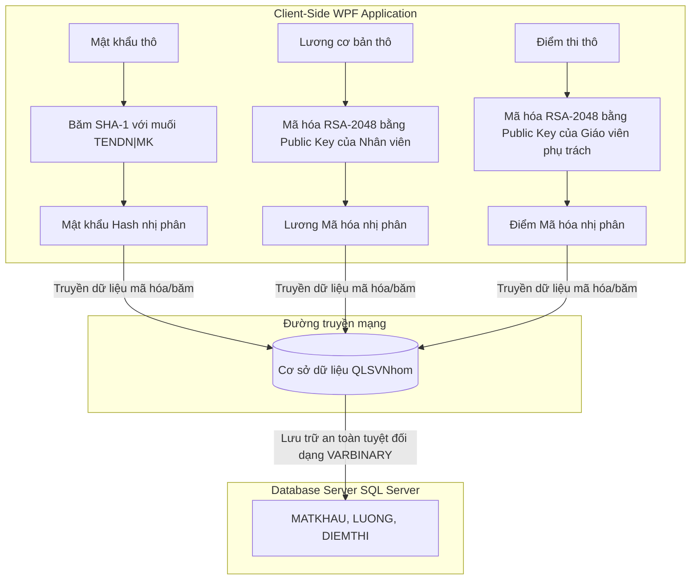

# Kimi - Hệ Thống Quản Lý Sinh Viên Bảo Mật Cao - Lab 4

<!-- Các Badges giới thiệu và công nghệ -->
[](https://opensource.org/licenses/MIT)
[](https://dotnet.microsoft.com)
[](https://www.microsoft.com/sql-server)
[](https://en.wikipedia.org/wiki/RSA_(cryptosystem))

Một hệ thống quản lý thông tin sinh viên, lớp học và học phần chuyên nghiệp trên nền tảng **WPF (C#)**. Hệ thống tích hợp cơ chế **mã hóa và băm dữ liệu hoàn toàn tại Client (Client-Side Encryption)** trước khi truyền qua mạng và lưu trữ tại **SQL Server**, giúp bảo vệ tuyệt đối dữ liệu nhạy cảm trước các nguy cơ tấn công mạng hoặc rò rỉ thông tin từ phía quản trị viên cơ sở dữ liệu (DBA).

---

## Mục lục
1. [Giới thiệu & Tính năng](#giới-thiệu--tính-năng)
2. [Cơ chế bảo mật cốt lõi](#cơ-chế-bảo-mật-cốt-lõi)
3. [Công nghệ sử dụng](#công-nghệ-sử-dụng)
4. [Hướng dẫn khởi chạy cục bộ](#hướng-dẫn-khởi-chạy-cục-bộ)
5. [Cấu trúc thư mục](#cấu-trúc-thư-mục)
6. [Giấy phép](#giấy-phép)

---

## Giới thiệu & Tính năng

**Kimi** giải quyết triệt độ bài toán rò rỉ dữ liệu điểm số và thông tin cá nhân trong các hệ thống quản lý trường học hiện nay. Nhờ áp dụng cơ chế mã hóa đầu cuối tại máy trạm, ngay cả quản trị viên cơ sở dữ liệu (DBA) hay kẻ tấn công nghe lén trên đường truyền mạng cũng không thể đọc được điểm thi hoặc lương của nhân viên nếu không có khóa bí mật cục bộ.

### Các tính năng cốt lõi:
- **Quản lý Lớp học:** Nhân viên quản lý và lập danh sách các lớp học thuộc phạm vi phụ trách của mình.
- **Quản lý Sinh viên:** Quản lý chi tiết hồ sơ sinh viên, phân lớp và cập nhật thông tin. Ràng buộc nghiệp vụ nghiêm ngặt chỉ cho phép sửa đổi thông tin sinh viên thuộc lớp mình trực tiếp quản lý.
- **Quản lý Học phần:** Quản lý danh mục môn học, số tín chỉ tương ứng.
- **Nhập điểm Bảo mật:** Điểm thi được mã hóa RSA-2048 ngay tại Client bằng khóa công khai của nhân viên trước khi truyền đi và lưu trữ tại bảng `BANGDIEM`.
- **Tra cứu Điểm (Transcripts):** Giải mã bảng điểm trực quan tại Client thông qua khóa riêng cục bộ của nhân viên phụ trách lớp.
- **Hồ sơ Cá nhân & Lương:** Xem thông tin cá nhân, đổi mật khẩu và giải mã mức lương cơ bản (`LUONG`) tại Client thông qua xác thực mật khẩu cá nhân.
- **Giám sát Truy vấn Real-time:** Tích hợp hộp thoại giám sát SQL Profiler trực tiếp trong ứng dụng để theo dõi các câu lệnh Dapper gửi đi trong thời gian thực, phục vụ học tập và kiểm thử.

---

## Cơ chế bảo mật cốt lõi

Dự án triển khai mô hình **An toàn thông tin phía người dùng (Client-Side Security)** toàn diện:

### 1. Băm Mật khẩu (SHA-1 Salted tại Client)
- Mật khẩu nhân viên và sinh viên được băm ngay tại Client bằng thuật toán **SHA-1** kết hợp muối dạng chuỗi: `TENDN + "|" + Password`.
- Cơ sở dữ liệu lưu trữ trực tiếp chuỗi hash nhị phân (`VARBINARY`) và so khớp trực tiếp, hoàn toàn loại bỏ các hàm băm `HASHBYTES` ở phía Server để tối ưu hiệu năng và bảo mật đường truyền.

### 2. Mã hóa Lương (Client-side Deterministic RSA-2048)
- Khi khởi tạo nhân viên mới, Client sinh cặp khóa Deterministic RSA-2048 xác định từ `(Password, MANV)`. Khóa công khai dạng XML được lưu trong cột `PUBKEY` ở cơ sở dữ liệu.
- Khóa riêng (Private Key) hoàn toàn **không** lưu cục bộ trên ổ đĩa máy tính hay lưu trên DB để tránh rò rỉ. Khi cần dùng (ví dụ giải mã lương hoặc giải mã điểm số), khóa riêng sẽ được tái tạo động tức thời từ mật khẩu và mã nhân viên bằng thuật toán sinh khóa xác định.
- Mức lương được mã hóa RSA-2048 tại Client trước khi lưu trữ vào DB. Khi hiển thị, người dùng nhập lại mật khẩu để Client tái tạo khóa riêng và giải mã trực tiếp.

### 3. Mã hóa Điểm số (Client-side RSA-2048)
- Điểm thi của sinh viên được mã hóa RSA bằng khóa công khai của nhân viên phụ trách lớp. Chỉ có nhân viên sở hữu khóa riêng tương ứng mới có thể giải mã và xem điểm.

### Sơ đồ Kiến trúc Bảo mật đầu cuối:



---

## Công nghệ sử dụng

Hệ thống được thiết kế theo cấu trúc hiện đại, hiệu năng cao và có tính thẩm mỹ giao diện vượt trội:

- **Frontend UI/UX:** Windows Presentation Foundation (WPF), ngôn ngữ thiết kế Modern UI với phông chữ Montserrat thời thượng, bảng màu Teal (#0F766E) và bóng đổ thẻ Card có chiều sâu.
- **Backend & Cryptography:** C# .NET Framework 4.8, thư viện bảo mật `System.Security.Cryptography`.
- **Data Access Layer:** Dapper Micro-ORM (tối ưu hóa tốc độ truy vấn, truyền tham số nhị phân an toàn tránh SQL Injection).
- **Database Engine:** Microsoft SQL Server (2019/2022).
- **Libraries:** `Newtonsoft.Json` (xử lý JSON), `ClosedXML` (xuất báo cáo Excel), `LiveCharts` (biểu đồ thống kê).

---

## Hướng dẫn khởi chạy cục bộ

Để cài đặt và vận hành hệ thống Kimi trên môi trường local, vui lòng thực hiện theo các bước tuần tự dưới đây:

### 1. Yêu cầu hệ thống tiên quyết
- Máy tính chạy hệ điều hành **Windows**.
- **.NET Framework 4.8 SDK** & Runtime (hỗ trợ .NET CLI hoặc Visual Studio 2022).
- **Microsoft SQL Server** (bản 2019, 2022 hoặc mới hơn).
- **SQL Server Management Studio (SSMS)** hoặc Azure Data Studio.
- **Git** cài đặt sẵn trên máy.

### 2. Các bước cài đặt tuần tự

**Bước 1: Sao chép mã nguồn về máy trạm local**
```bash
git clone https://github.com/your-username/LAB_BMCSDL-Lab4.git
cd LAB_BMCSDL-Lab4
```

**Bước 2: Cài đặt và cấu hình Cơ sở dữ liệu**
Đảm bảo máy chủ SQL Server đang hoạt động (Ví dụ Server có tên là `ZEUS`). Thực thi các tệp tin SQL trong thư mục [DatabaseScripts](file:///d:/BMCSDL/LAB_BMCSDL - Lab4/src/DatabaseScripts) theo đúng thứ tự:

1. Chạy [01_Schema.sql](file:///d:/BMCSDL/LAB_BMCSDL - Lab4/src/DatabaseScripts/01_Schema.sql) để tạo database `QLSVNhom` và thiết lập Master Key.
2. Chạy [02_Procedures.sql](file:///d:/BMCSDL/LAB_BMCSDL - Lab4/src/DatabaseScripts/02_Procedures.sql) để tạo các Stored Procedure nghiệp vụ bảo mật Client-side.
3. Chạy [03_SeedData.sql](file:///d:/BMCSDL/LAB_BMCSDL - Lab4/src/DatabaseScripts/03_SeedData.sql) để nạp dữ liệu mẫu (Nhân viên, Sinh viên, Lớp...).

Hoặc chạy dòng lệnh sau trên Terminal (sử dụng cờ `-C` để tin cậy chứng chỉ kết nối):
```bash
# 1. Tạo Database và Master Key
sqlcmd -S ZEUS -E -C -i "src/DatabaseScripts/01_Schema.sql"

# 2. Tạo các Stored Procedure
sqlcmd -S ZEUS -E -C -i "src/DatabaseScripts/02_Procedures.sql"

# 3. Nạp dữ liệu mẫu
sqlcmd -S ZEUS -E -C -i "src/DatabaseScripts/03_SeedData.sql"
```

> [!NOTE]
> **Mật khẩu mặc định của các tài khoản mẫu sau khi chạy seed data:**
> - Nhân viên 1: Tài khoản `nva` - Mật khẩu `abcd12`
> - Nhân viên 2: Tài khoản `ttb` - Mật khẩu `pass123`
> - Mật khẩu của tất cả sinh viên mẫu: `sv123` (Ví dụ SV01 tài khoản `lvc` - mật khẩu `sv123`).

**Bước 3: Cấu hình chuỗi kết nối ứng dụng (Connection String)**
Mở tệp [App.config](file:///d:/BMCSDL/LAB_BMCSDL - Lab4/src/StudentManager/App.config) trong thư mục dự án và điều chỉnh thuộc tính `connectionString` trong thẻ `<connectionStrings>` cho khớp với tên máy chủ SQL Server thực tế của bạn:

```xml
<connectionStrings>
    <add name="QLSVNhom" 
         connectionString="Data Source=YOUR_SERVER_NAME;Initial Catalog=QLSVNhom;Integrated Security=True;Encrypt=True;TrustServerCertificate=True;" 
         providerName="Microsoft.Data.SqlClient" />
</connectionStrings>
```

> [!WARNING]
> **Bảo mật thông tin tuyệt đối:** Không bao giờ đẩy mật khẩu đăng nhập DB (như tài khoản `sa`) lên Git công khai. Ưu tiên sử dụng `Integrated Security=True` (Windows Authentication) cho môi trường phát triển cục bộ.

**Bước 4: Build và chạy ứng dụng**
Biên dịch dự án WPF bằng dòng lệnh hoặc mở thư mục nguồn bằng Visual Studio 2022:
```bash
dotnet build src/StudentManager/StudentManager.csproj
```
Sau khi build thành công, tệp thực thi `StudentManager.exe` sẽ được tạo ra tại thư mục `src/StudentManager/bin/Debug/net48/`. Tiến hành chạy ứng dụng và đăng nhập bằng tài khoản mẫu `nva` để trải nghiệm hệ thống!

---

## Cấu trúc thư mục

Sơ đồ hình cây trực quan thể hiện kiến trúc phân lớp của dự án:

```text
LAB_BMCSDL - Lab4/
├── Documentation/               # Tài liệu thiết kế hệ thống và đề bài thực hành
│   ├── README.md                # Tài liệu hướng dẫn sử dụng gốc
│   └── lab03.pdf                # Đề bài các môn học liên quan
├── src/
│   ├── DatabaseScripts/         # Các Script CSDL SQL Server
│   │   ├── 01_Schema.sql        # Cấu trúc bảng vật lý và MASTER KEY
│   │   ├── 02_Procedures.sql    # Các stored procedures bảo mật Client-side
│   │   ├── 03_SeedData.sql      # Nạp dữ liệu mẫu (Nhân viên, Sinh viên, Lớp...)
│   │   ├── Tool_Profiler.sql    # Extended Events kiểm tra mã hóa đường truyền
│   │   └── Tool_Tests.sql       # Chạy Unit Tests tự động trên database
│   │
│   └── StudentManager/          # Mã nguồn ứng dụng WPF C# (.NET 4.8)
│       ├── App.config           # Tệp cấu hình Connection String
│       ├── Theme.xaml           # Hệ thống Styles, Phông chữ, Palette màu Teal
│       ├── Helpers/             # Các thư viện tiện ích mã hóa và kết nối
│       │   ├── CryptoHelper.cs       # Mã hóa RSA-2048, băm SHA-1 nhị phân tại Client
│       │   ├── DatabaseHelper.cs     # Quản lý kết nối Dapper CSDL
│       │   └── RsaKeyProvisioning.cs # Quản lý & khôi phục cặp khóa RSA mẫu
│       ├── Models/              # Lớp đối tượng (Entities/DTOs)
│       ├── ViewModels/          # Điều khiển logic hiển thị (Tầng VM)
│       └── Views/               # Giao diện XAML (Tầng View)
├── rule_README.md               # Quy chuẩn viết tài liệu README
└── README.md                    # File tài liệu hướng dẫn chính này (bản hoàn chỉnh)
```

---

## Giấy phép

Dự án này được phân phối công khai và cấp phép hợp pháp dưới dạng **Giấy phép MIT License**. Thông tin chi tiết vui lòng xem tại tệp `LICENSE` đính kèm trong thư mục gốc.
